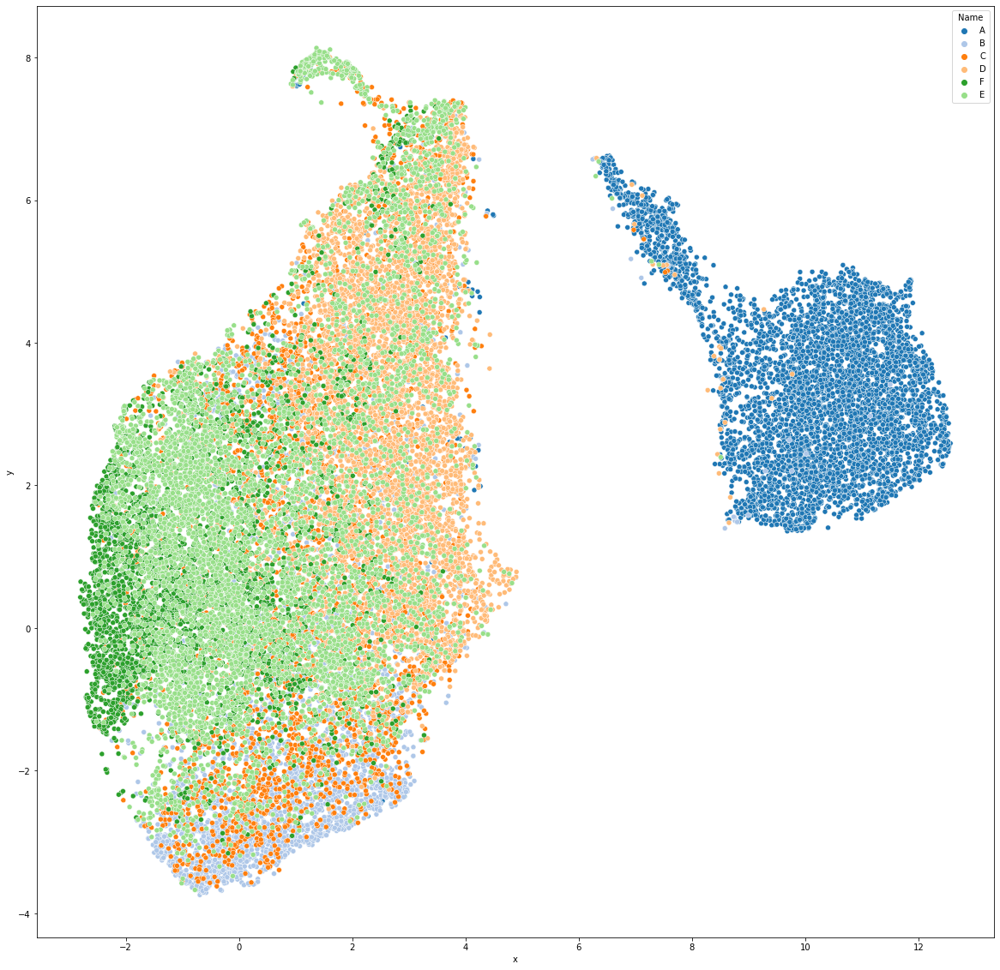
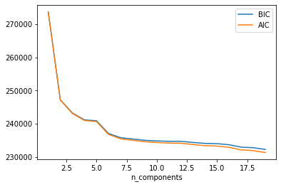
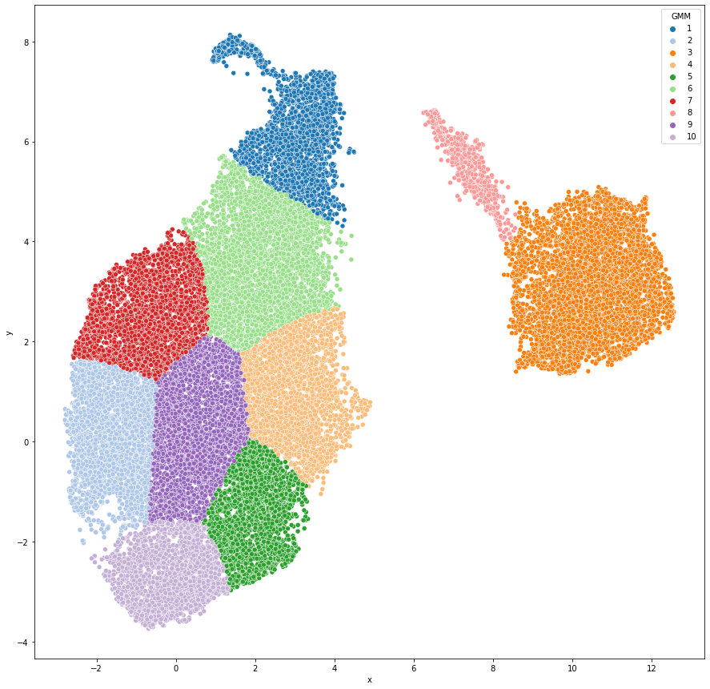
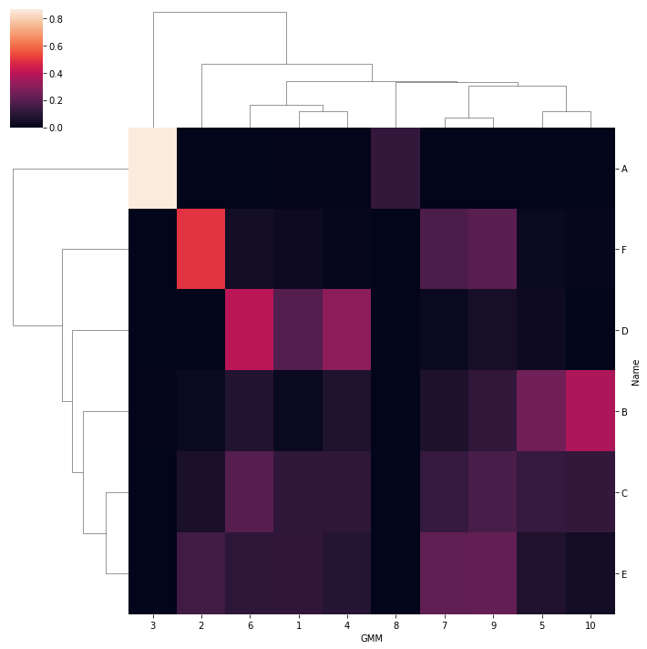

```python
import pandas as pd
import matplotlib.pyplot as plt
import seaborn as sns
from sklearn.preprocessing import StandardScaler
import umap
```

    /home/nash/anaconda3/lib/python3.8/site-packages/umap/__init__.py:9: UserWarning: Tensorflow not installed; ParametricUMAP will be unavailable
      warn("Tensorflow not installed; ParametricUMAP will be unavailable")


```python
df = pd.read_csv("./Spiradenocarcinomax40.ndpi.txt", sep="\t")
```


```python
df = df[["Image", "Parent", 'Centroid X µm',
       'Centroid Y µm', 'Nucleus: Area µm^2',
       'Nucleus: Length µm',  'Nucleus: Max diameter µm', 'Nucleus: Min diameter µm',
       'Hematoxylin: Nucleus: Mean',
       'Hematoxylin: Nucleus: Median', 'Hematoxylin: Nucleus: Min',
       'Hematoxylin: Nucleus: Max', 'Hematoxylin: Nucleus: Std.Dev.',
       'Hematoxylin: Cytoplasm: Mean', 'Hematoxylin: Cytoplasm: Median',
       'Hematoxylin: Cytoplasm: Min', 'Hematoxylin: Cytoplasm: Max',
       'Hematoxylin: Cytoplasm: Std.Dev.', 
       'Hematoxylin: Cell: Mean', 'Hematoxylin: Cell: Median',
       'Hematoxylin: Cell: Min', 'Hematoxylin: Cell: Max',
       'Hematoxylin: Cell: Std.Dev.', 'Eosin: Nucleus: Mean',
       'Eosin: Nucleus: Median', 'Eosin: Nucleus: Min', 'Eosin: Nucleus: Max',
       'Eosin: Nucleus: Std.Dev.', 'Eosin: Cytoplasm: Mean',
       'Eosin: Cytoplasm: Median', 'Eosin: Cytoplasm: Min',
       'Eosin: Cytoplasm: Max', 'Eosin: Cytoplasm: Std.Dev.',
        'Eosin: Cell: Mean', 'Eosin: Cell: Median',
       'Eosin: Cell: Min', 'Eosin: Cell: Max', 'Eosin: Cell: Std.Dev.']]
df.dropna(inplace=True)
X = df.drop(["Image", "Parent", 'Centroid X µm',
       'Centroid Y µm'], axis=1)
```


```python
X
```


<div>
<style scoped>
    .dataframe tbody tr th:only-of-type {
        vertical-align: middle;
    }

    .dataframe tbody tr th {
        vertical-align: top;
    }

    .dataframe thead th {
        text-align: right;
    }
</style>
<table border="1" class="dataframe">
  <thead>
    <tr style="text-align: right;">
      <th></th>
      <th>Nucleus: Area µm^2</th>
      <th>Nucleus: Length µm</th>
      <th>Nucleus: Max diameter µm</th>
      <th>Nucleus: Min diameter µm</th>
      <th>Hematoxylin: Nucleus: Mean</th>
      <th>Hematoxylin: Nucleus: Median</th>
      <th>Hematoxylin: Nucleus: Min</th>
      <th>Hematoxylin: Nucleus: Max</th>
      <th>Hematoxylin: Nucleus: Std.Dev.</th>
      <th>Hematoxylin: Cytoplasm: Mean</th>
      <th>...</th>
      <th>Eosin: Cytoplasm: Mean</th>
      <th>Eosin: Cytoplasm: Median</th>
      <th>Eosin: Cytoplasm: Min</th>
      <th>Eosin: Cytoplasm: Max</th>
      <th>Eosin: Cytoplasm: Std.Dev.</th>
      <th>Eosin: Cell: Mean</th>
      <th>Eosin: Cell: Median</th>
      <th>Eosin: Cell: Min</th>
      <th>Eosin: Cell: Max</th>
      <th>Eosin: Cell: Std.Dev.</th>
    </tr>
  </thead>
  <tbody>
    <tr>
      <th>0</th>
      <td>45.1857</td>
      <td>24.2234</td>
      <td>8.2323</td>
      <td>7.0998</td>
      <td>0.3550</td>
      <td>0.3238</td>
      <td>0.0555</td>
      <td>0.9290</td>
      <td>0.1489</td>
      <td>0.1950</td>
      <td>...</td>
      <td>0.0329</td>
      <td>0.0459</td>
      <td>-0.4678</td>
      <td>0.1696</td>
      <td>0.0633</td>
      <td>0.0216</td>
      <td>0.0351</td>
      <td>-0.4678</td>
      <td>0.1696</td>
      <td>0.0656</td>
    </tr>
    <tr>
      <th>1</th>
      <td>32.5518</td>
      <td>21.0359</td>
      <td>7.8993</td>
      <td>5.3820</td>
      <td>0.3370</td>
      <td>0.3250</td>
      <td>0.0633</td>
      <td>0.6239</td>
      <td>0.1259</td>
      <td>0.2014</td>
      <td>...</td>
      <td>0.0460</td>
      <td>0.0497</td>
      <td>-0.1546</td>
      <td>0.1656</td>
      <td>0.0431</td>
      <td>0.0309</td>
      <td>0.0374</td>
      <td>-0.1546</td>
      <td>0.1656</td>
      <td>0.0528</td>
    </tr>
    <tr>
      <th>2</th>
      <td>14.9737</td>
      <td>14.0061</td>
      <td>4.9352</td>
      <td>3.9790</td>
      <td>0.2883</td>
      <td>0.2739</td>
      <td>0.0083</td>
      <td>0.8496</td>
      <td>0.1434</td>
      <td>0.1443</td>
      <td>...</td>
      <td>0.0596</td>
      <td>0.0637</td>
      <td>-0.0985</td>
      <td>0.1403</td>
      <td>0.0387</td>
      <td>0.0392</td>
      <td>0.0520</td>
      <td>-0.3012</td>
      <td>0.1403</td>
      <td>0.0587</td>
    </tr>
    <tr>
      <th>3</th>
      <td>22.2726</td>
      <td>17.4277</td>
      <td>6.4979</td>
      <td>4.4502</td>
      <td>0.4189</td>
      <td>0.3934</td>
      <td>0.0122</td>
      <td>1.1295</td>
      <td>0.1993</td>
      <td>0.2008</td>
      <td>...</td>
      <td>0.0350</td>
      <td>0.0394</td>
      <td>-0.2490</td>
      <td>0.1780</td>
      <td>0.0576</td>
      <td>-0.0010</td>
      <td>0.0156</td>
      <td>-0.4355</td>
      <td>0.1780</td>
      <td>0.0857</td>
    </tr>
    <tr>
      <th>4</th>
      <td>61.9201</td>
      <td>28.3856</td>
      <td>9.9302</td>
      <td>8.3978</td>
      <td>0.4314</td>
      <td>0.4138</td>
      <td>-0.0224</td>
      <td>1.0802</td>
      <td>0.2029</td>
      <td>0.2073</td>
      <td>...</td>
      <td>0.0306</td>
      <td>0.0436</td>
      <td>-0.1834</td>
      <td>0.1433</td>
      <td>0.0572</td>
      <td>-0.0072</td>
      <td>0.0071</td>
      <td>-0.3240</td>
      <td>0.1433</td>
      <td>0.0803</td>
    </tr>
    <tr>
      <th>...</th>
      <td>...</td>
      <td>...</td>
      <td>...</td>
      <td>...</td>
      <td>...</td>
      <td>...</td>
      <td>...</td>
      <td>...</td>
      <td>...</td>
      <td>...</td>
      <td>...</td>
      <td>...</td>
      <td>...</td>
      <td>...</td>
      <td>...</td>
      <td>...</td>
      <td>...</td>
      <td>...</td>
      <td>...</td>
      <td>...</td>
      <td>...</td>
    </tr>
    <tr>
      <th>27041</th>
      <td>26.2229</td>
      <td>18.9879</td>
      <td>6.4870</td>
      <td>5.3621</td>
      <td>0.3934</td>
      <td>0.4002</td>
      <td>0.0204</td>
      <td>0.7864</td>
      <td>0.1557</td>
      <td>0.2882</td>
      <td>...</td>
      <td>0.1711</td>
      <td>0.1687</td>
      <td>-0.0187</td>
      <td>0.2973</td>
      <td>0.0603</td>
      <td>0.1751</td>
      <td>0.1755</td>
      <td>-0.0187</td>
      <td>0.3192</td>
      <td>0.0621</td>
    </tr>
    <tr>
      <th>27042</th>
      <td>47.6428</td>
      <td>26.1651</td>
      <td>9.7784</td>
      <td>6.7852</td>
      <td>0.3089</td>
      <td>0.2820</td>
      <td>0.0259</td>
      <td>0.7537</td>
      <td>0.1437</td>
      <td>0.2489</td>
      <td>...</td>
      <td>0.1562</td>
      <td>0.1643</td>
      <td>-0.0957</td>
      <td>0.3329</td>
      <td>0.0606</td>
      <td>0.1577</td>
      <td>0.1652</td>
      <td>-0.0957</td>
      <td>0.3329</td>
      <td>0.0581</td>
    </tr>
    <tr>
      <th>27043</th>
      <td>18.9301</td>
      <td>19.8659</td>
      <td>6.7615</td>
      <td>4.8902</td>
      <td>0.3991</td>
      <td>0.4064</td>
      <td>0.0221</td>
      <td>0.8500</td>
      <td>0.1636</td>
      <td>0.1467</td>
      <td>...</td>
      <td>0.2098</td>
      <td>0.2120</td>
      <td>-0.0088</td>
      <td>0.3342</td>
      <td>0.0531</td>
      <td>0.1922</td>
      <td>0.2030</td>
      <td>-0.1230</td>
      <td>0.4065</td>
      <td>0.0772</td>
    </tr>
    <tr>
      <th>27044</th>
      <td>17.3020</td>
      <td>15.4072</td>
      <td>5.8376</td>
      <td>3.9603</td>
      <td>0.4279</td>
      <td>0.4196</td>
      <td>0.2034</td>
      <td>0.7863</td>
      <td>0.1252</td>
      <td>0.1016</td>
      <td>...</td>
      <td>0.1771</td>
      <td>0.1880</td>
      <td>0.0466</td>
      <td>0.3033</td>
      <td>0.0551</td>
      <td>0.1777</td>
      <td>0.1876</td>
      <td>0.0306</td>
      <td>0.3033</td>
      <td>0.0542</td>
    </tr>
    <tr>
      <th>27045</th>
      <td>33.7241</td>
      <td>21.9941</td>
      <td>8.0997</td>
      <td>5.3379</td>
      <td>0.4432</td>
      <td>0.4268</td>
      <td>-0.0397</td>
      <td>1.0529</td>
      <td>0.2185</td>
      <td>0.1385</td>
      <td>...</td>
      <td>0.1493</td>
      <td>0.1466</td>
      <td>-0.0879</td>
      <td>0.3085</td>
      <td>0.0549</td>
      <td>0.1469</td>
      <td>0.1539</td>
      <td>-0.3133</td>
      <td>0.3127</td>
      <td>0.0781</td>
    </tr>
  </tbody>
</table>
<p>27045 rows × 34 columns</p>
</div>


```python
df
```


<div>
<style scoped>
    .dataframe tbody tr th:only-of-type {
        vertical-align: middle;
    }

    .dataframe tbody tr th {
        vertical-align: top;
    }

    .dataframe thead th {
        text-align: right;
    }
</style>
<table border="1" class="dataframe">
  <thead>
    <tr style="text-align: right;">
      <th></th>
      <th>Image</th>
      <th>Parent</th>
      <th>Centroid X µm</th>
      <th>Centroid Y µm</th>
      <th>Nucleus: Area µm^2</th>
      <th>Nucleus: Length µm</th>
      <th>Nucleus: Max diameter µm</th>
      <th>Nucleus: Min diameter µm</th>
      <th>Hematoxylin: Nucleus: Mean</th>
      <th>Hematoxylin: Nucleus: Median</th>
      <th>...</th>
      <th>Eosin: Cytoplasm: Mean</th>
      <th>Eosin: Cytoplasm: Median</th>
      <th>Eosin: Cytoplasm: Min</th>
      <th>Eosin: Cytoplasm: Max</th>
      <th>Eosin: Cytoplasm: Std.Dev.</th>
      <th>Eosin: Cell: Mean</th>
      <th>Eosin: Cell: Median</th>
      <th>Eosin: Cell: Min</th>
      <th>Eosin: Cell: Max</th>
      <th>Eosin: Cell: Std.Dev.</th>
    </tr>
  </thead>
  <tbody>
    <tr>
      <th>0</th>
      <td>Spiradenocarcinomax40.ndpi</td>
      <td>A</td>
      <td>8116.9</td>
      <td>17812.8</td>
      <td>45.1857</td>
      <td>24.2234</td>
      <td>8.2323</td>
      <td>7.0998</td>
      <td>0.3550</td>
      <td>0.3238</td>
      <td>...</td>
      <td>0.0329</td>
      <td>0.0459</td>
      <td>-0.4678</td>
      <td>0.1696</td>
      <td>0.0633</td>
      <td>0.0216</td>
      <td>0.0351</td>
      <td>-0.4678</td>
      <td>0.1696</td>
      <td>0.0656</td>
    </tr>
    <tr>
      <th>1</th>
      <td>Spiradenocarcinomax40.ndpi</td>
      <td>A</td>
      <td>8127.4</td>
      <td>17813.4</td>
      <td>32.5518</td>
      <td>21.0359</td>
      <td>7.8993</td>
      <td>5.3820</td>
      <td>0.3370</td>
      <td>0.3250</td>
      <td>...</td>
      <td>0.0460</td>
      <td>0.0497</td>
      <td>-0.1546</td>
      <td>0.1656</td>
      <td>0.0431</td>
      <td>0.0309</td>
      <td>0.0374</td>
      <td>-0.1546</td>
      <td>0.1656</td>
      <td>0.0528</td>
    </tr>
    <tr>
      <th>2</th>
      <td>Spiradenocarcinomax40.ndpi</td>
      <td>A</td>
      <td>8134.9</td>
      <td>17817.5</td>
      <td>14.9737</td>
      <td>14.0061</td>
      <td>4.9352</td>
      <td>3.9790</td>
      <td>0.2883</td>
      <td>0.2739</td>
      <td>...</td>
      <td>0.0596</td>
      <td>0.0637</td>
      <td>-0.0985</td>
      <td>0.1403</td>
      <td>0.0387</td>
      <td>0.0392</td>
      <td>0.0520</td>
      <td>-0.3012</td>
      <td>0.1403</td>
      <td>0.0587</td>
    </tr>
    <tr>
      <th>3</th>
      <td>Spiradenocarcinomax40.ndpi</td>
      <td>A</td>
      <td>8134.1</td>
      <td>17822.4</td>
      <td>22.2726</td>
      <td>17.4277</td>
      <td>6.4979</td>
      <td>4.4502</td>
      <td>0.4189</td>
      <td>0.3934</td>
      <td>...</td>
      <td>0.0350</td>
      <td>0.0394</td>
      <td>-0.2490</td>
      <td>0.1780</td>
      <td>0.0576</td>
      <td>-0.0010</td>
      <td>0.0156</td>
      <td>-0.4355</td>
      <td>0.1780</td>
      <td>0.0857</td>
    </tr>
    <tr>
      <th>4</th>
      <td>Spiradenocarcinomax40.ndpi</td>
      <td>A</td>
      <td>8123.8</td>
      <td>17824.7</td>
      <td>61.9201</td>
      <td>28.3856</td>
      <td>9.9302</td>
      <td>8.3978</td>
      <td>0.4314</td>
      <td>0.4138</td>
      <td>...</td>
      <td>0.0306</td>
      <td>0.0436</td>
      <td>-0.1834</td>
      <td>0.1433</td>
      <td>0.0572</td>
      <td>-0.0072</td>
      <td>0.0071</td>
      <td>-0.3240</td>
      <td>0.1433</td>
      <td>0.0803</td>
    </tr>
    <tr>
      <th>...</th>
      <td>...</td>
      <td>...</td>
      <td>...</td>
      <td>...</td>
      <td>...</td>
      <td>...</td>
      <td>...</td>
      <td>...</td>
      <td>...</td>
      <td>...</td>
      <td>...</td>
      <td>...</td>
      <td>...</td>
      <td>...</td>
      <td>...</td>
      <td>...</td>
      <td>...</td>
      <td>...</td>
      <td>...</td>
      <td>...</td>
      <td>...</td>
    </tr>
    <tr>
      <th>27041</th>
      <td>Spiradenocarcinomax40.ndpi</td>
      <td>E</td>
      <td>33288.1</td>
      <td>14523.0</td>
      <td>26.2229</td>
      <td>18.9879</td>
      <td>6.4870</td>
      <td>5.3621</td>
      <td>0.3934</td>
      <td>0.4002</td>
      <td>...</td>
      <td>0.1711</td>
      <td>0.1687</td>
      <td>-0.0187</td>
      <td>0.2973</td>
      <td>0.0603</td>
      <td>0.1751</td>
      <td>0.1755</td>
      <td>-0.0187</td>
      <td>0.3192</td>
      <td>0.0621</td>
    </tr>
    <tr>
      <th>27042</th>
      <td>Spiradenocarcinomax40.ndpi</td>
      <td>E</td>
      <td>33355.1</td>
      <td>14525.0</td>
      <td>47.6428</td>
      <td>26.1651</td>
      <td>9.7784</td>
      <td>6.7852</td>
      <td>0.3089</td>
      <td>0.2820</td>
      <td>...</td>
      <td>0.1562</td>
      <td>0.1643</td>
      <td>-0.0957</td>
      <td>0.3329</td>
      <td>0.0606</td>
      <td>0.1577</td>
      <td>0.1652</td>
      <td>-0.0957</td>
      <td>0.3329</td>
      <td>0.0581</td>
    </tr>
    <tr>
      <th>27043</th>
      <td>Spiradenocarcinomax40.ndpi</td>
      <td>E</td>
      <td>33332.0</td>
      <td>14525.4</td>
      <td>18.9301</td>
      <td>19.8659</td>
      <td>6.7615</td>
      <td>4.8902</td>
      <td>0.3991</td>
      <td>0.4064</td>
      <td>...</td>
      <td>0.2098</td>
      <td>0.2120</td>
      <td>-0.0088</td>
      <td>0.3342</td>
      <td>0.0531</td>
      <td>0.1922</td>
      <td>0.2030</td>
      <td>-0.1230</td>
      <td>0.4065</td>
      <td>0.0772</td>
    </tr>
    <tr>
      <th>27044</th>
      <td>Spiradenocarcinomax40.ndpi</td>
      <td>E</td>
      <td>33318.2</td>
      <td>14524.4</td>
      <td>17.3020</td>
      <td>15.4072</td>
      <td>5.8376</td>
      <td>3.9603</td>
      <td>0.4279</td>
      <td>0.4196</td>
      <td>...</td>
      <td>0.1771</td>
      <td>0.1880</td>
      <td>0.0466</td>
      <td>0.3033</td>
      <td>0.0551</td>
      <td>0.1777</td>
      <td>0.1876</td>
      <td>0.0306</td>
      <td>0.3033</td>
      <td>0.0542</td>
    </tr>
    <tr>
      <th>27045</th>
      <td>Spiradenocarcinomax40.ndpi</td>
      <td>E</td>
      <td>33298.1</td>
      <td>14526.4</td>
      <td>33.7241</td>
      <td>21.9941</td>
      <td>8.0997</td>
      <td>5.3379</td>
      <td>0.4432</td>
      <td>0.4268</td>
      <td>...</td>
      <td>0.1493</td>
      <td>0.1466</td>
      <td>-0.0879</td>
      <td>0.3085</td>
      <td>0.0549</td>
      <td>0.1469</td>
      <td>0.1539</td>
      <td>-0.3133</td>
      <td>0.3127</td>
      <td>0.0781</td>
    </tr>
  </tbody>
</table>
<p>27045 rows × 38 columns</p>
</div>


```python
feature = ['Nucleus: Area µm^2', 'Nucleus: Length µm',
        'Nucleus: Max diameter µm','Hematoxylin: Nucleus: Median', 'Hematoxylin: Nucleus: Min',
       'Hematoxylin: Nucleus: Max', 
       'Hematoxylin: Cytoplasm: Mean', 'Hematoxylin: Cell: Mean',
       'Hematoxylin: Cell: Median', 
       'Eosin: Nucleus: Mean',  'Eosin: Cell: Mean']

plt.figure(figsize = (15, 30))
for i in enumerate(feature):
    plt.subplot(6, 2, i[0]+1)
    sns.boxplot(x=i[1], y="Parent", data = df)
```


    

    


```python
Scaler = StandardScaler()
x_std = Scaler.fit_transform(X)
```


```python
reducer = umap.UMAP()
mapper = reducer.fit(x_std)
```


```python
embedding = mapper.embedding_
UMAPData = pd.DataFrame(embedding, columns=["x", "y"])
UMAPData["Name"] = df.Parent
```


```python
plt.figure(figsize=(20, 20))
sns.scatterplot(x=UMAPData["x"], y=UMAPData["y"],  hue=UMAPData["Name"], palette="tab20")
```


    <AxesSubplot:xlabel='x', ylabel='y'>


    

    


```python
import numpy as np
from sklearn.mixture import GaussianMixture  as GMM
n_components = np.arange(1, 20)
models = [GMM(n_components=n, covariance_type='full', random_state=0, max_iter=500).fit(embedding)
          for n in n_components]

plt.plot(n_components, [m.bic(embedding) for m in models], label='BIC')
plt.plot(n_components, [m.aic(embedding) for m in models], label='AIC')
plt.legend(loc='best')
plt.xlabel('n_components');
```


    

    


```python
from sklearn.mixture import GaussianMixture as GMM     # 1. Choose the model class

model = GMM(n_components=10,
            covariance_type='full')  # 2. Instantiate the model with hyperparameters　#BGMMではなくGMMを使ってしまっている！！
model.fit(embedding)                    # 3. Fit to data. Notice y is not specified!
y_gmm = model.predict(embedding)        # 4. Determine cluster labels

```


```python
y_gmm
```


    array([2, 2, 2, ..., 8, 3, 8])


```python
df["GMM_cluster"] = y_gmm +1
```


```python
UMAPData["GMM"] = y_gmm + 1 
plt.figure(figsize=(15, 15))
sns.scatterplot(x=UMAPData["x"], y=UMAPData["y"], hue=UMAPData["GMM"], palette="tab20")

```


    <AxesSubplot:xlabel='x', ylabel='y'>


    

    


```python
crosstb = pd.crosstab(UMAPData.Name, UMAPData.GMM, normalize="index")
```


```python
g = sns.clustermap(crosstb)
plt.setp(g.ax_heatmap.get_yticklabels(), rotation=0)
plt.savefig("ClusterSpiradenocaricnomax40.png")
```


    

    


```python
df_export = df[['Centroid X µm', 'Centroid Y µm', "Image", 'GMM_cluster']]
```


```python
df_export.reset_index(inplace=True, drop=True)
```


```python
df_export["Image"] = "Hidradenocarcinoma_3.ndpi (2)"
```

    <ipython-input-21-16c2dbb11900>:1: SettingWithCopyWarning: 
    A value is trying to be set on a copy of a slice from a DataFrame.
    Try using .loc[row_indexer,col_indexer] = value instead
    
    See the caveats in the documentation: https://pandas.pydata.org/pandas-docs/stable/user_guide/indexing.html#returning-a-view-versus-a-copy
      df_export["Image"] = "Hidradenocarcinoma_3.ndpi (2)"


```python
df_export
```


<div>
<style scoped>
    .dataframe tbody tr th:only-of-type {
        vertical-align: middle;
    }

    .dataframe tbody tr th {
        vertical-align: top;
    }

    .dataframe thead th {
        text-align: right;
    }
</style>
<table border="1" class="dataframe">
  <thead>
    <tr style="text-align: right;">
      <th></th>
      <th>Centroid X µm</th>
      <th>Centroid Y µm</th>
      <th>Image</th>
      <th>GMM_cluster</th>
    </tr>
  </thead>
  <tbody>
    <tr>
      <th>0</th>
      <td>10464.0</td>
      <td>13827.8</td>
      <td>Hidradenocarcinoma_3.ndpi (2)</td>
      <td>4</td>
    </tr>
    <tr>
      <th>1</th>
      <td>10423.0</td>
      <td>13833.6</td>
      <td>Hidradenocarcinoma_3.ndpi (2)</td>
      <td>9</td>
    </tr>
    <tr>
      <th>2</th>
      <td>10405.5</td>
      <td>13837.1</td>
      <td>Hidradenocarcinoma_3.ndpi (2)</td>
      <td>9</td>
    </tr>
    <tr>
      <th>3</th>
      <td>10372.9</td>
      <td>13840.0</td>
      <td>Hidradenocarcinoma_3.ndpi (2)</td>
      <td>9</td>
    </tr>
    <tr>
      <th>4</th>
      <td>10362.3</td>
      <td>13842.7</td>
      <td>Hidradenocarcinoma_3.ndpi (2)</td>
      <td>9</td>
    </tr>
    <tr>
      <th>...</th>
      <td>...</td>
      <td>...</td>
      <td>...</td>
      <td>...</td>
    </tr>
    <tr>
      <th>41131</th>
      <td>40153.5</td>
      <td>4182.2</td>
      <td>Hidradenocarcinoma_3.ndpi (2)</td>
      <td>14</td>
    </tr>
    <tr>
      <th>41132</th>
      <td>40311.2</td>
      <td>4181.8</td>
      <td>Hidradenocarcinoma_3.ndpi (2)</td>
      <td>6</td>
    </tr>
    <tr>
      <th>41133</th>
      <td>40184.8</td>
      <td>4182.3</td>
      <td>Hidradenocarcinoma_3.ndpi (2)</td>
      <td>14</td>
    </tr>
    <tr>
      <th>41134</th>
      <td>40342.3</td>
      <td>4185.6</td>
      <td>Hidradenocarcinoma_3.ndpi (2)</td>
      <td>6</td>
    </tr>
    <tr>
      <th>41135</th>
      <td>40202.0</td>
      <td>4186.5</td>
      <td>Hidradenocarcinoma_3.ndpi (2)</td>
      <td>14</td>
    </tr>
  </tbody>
</table>
<p>41136 rows × 4 columns</p>
</div>


```python
df_export.to_csv("Hidradenocarcinoma_AtoH.csv", index=False)
```


```python

```
